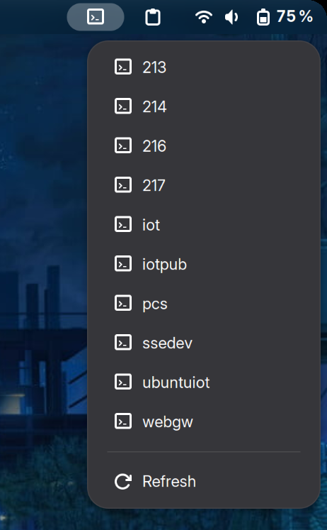
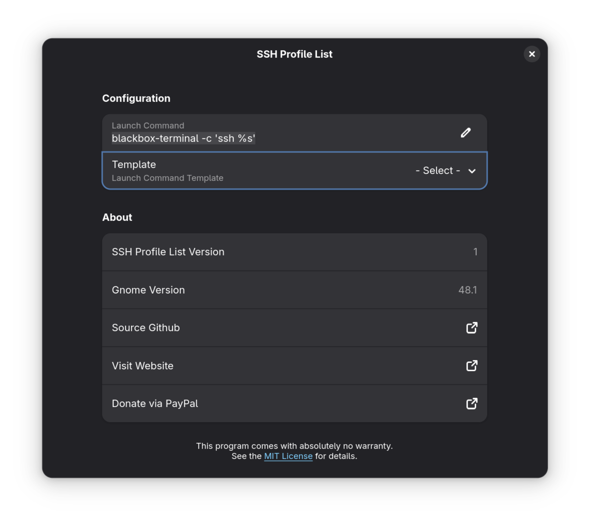

# SSH Profile List

SSH Profile List is a GNOME extension that allows you to show SSH connections from `.ssh/config` file directly from the GNOME panel systray. This extension is fork of https://github.com/pramalho/guake-ssh-extension that modified to run on any terminal.

## Screenshots

## License

This extension is licensed under the [MIT License](LICENSE).